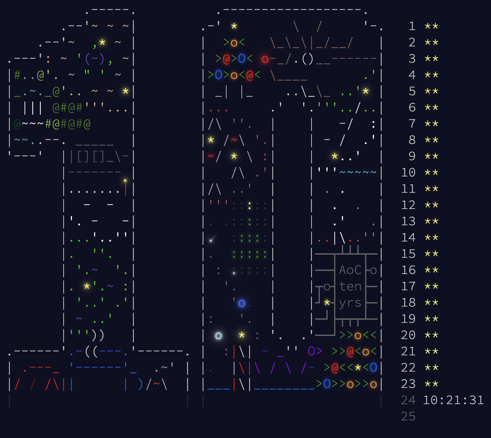

# Advent of Code 2024

## Finishing Tree <3

## My Favourite Days
### 1) [Day 14](/14) ANTI LLM? Xmas Trees
You have to wonder if this question was made specifically for LLMs to struggle.
This was good fun, even though I had to trial and error my size of connected areas down to 150.

### 2) [Day 8](/8) Vectors
It was great to see and use some of the vectors knowledge from first year and a-levels.

### 3) [Day 11](/11) Dynamic Programming
First time (if I remember correctly) you couldn't brute force and it was nice to implement some dynamic programming (again first year)

### 4) [Day 13](/13) Number Theory
Implemented the Extended Euclidean Algorithm for solving Diophantine equations. 

We were solving for **integer solutions** to a linear equation, which can be optimized.

The integer solutions bit was interesting due to not knowing if the small epsilons were floating point error or not.

### 5) [Day 23](/23) Graphs and Cliques 

Briefly encountered cliques in data and algos too. Was nice to implement the Bron-Kerbosch algorithm.

